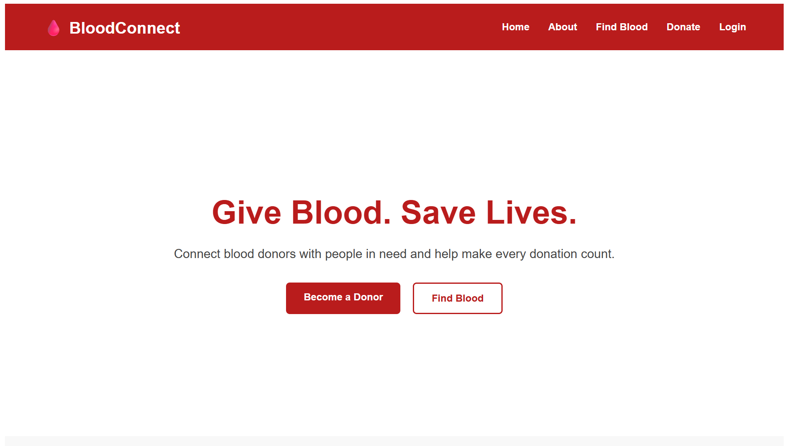
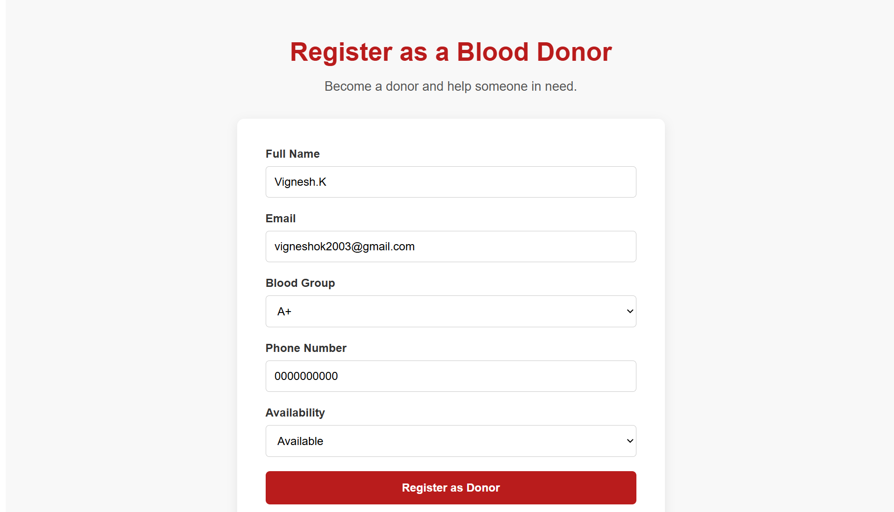
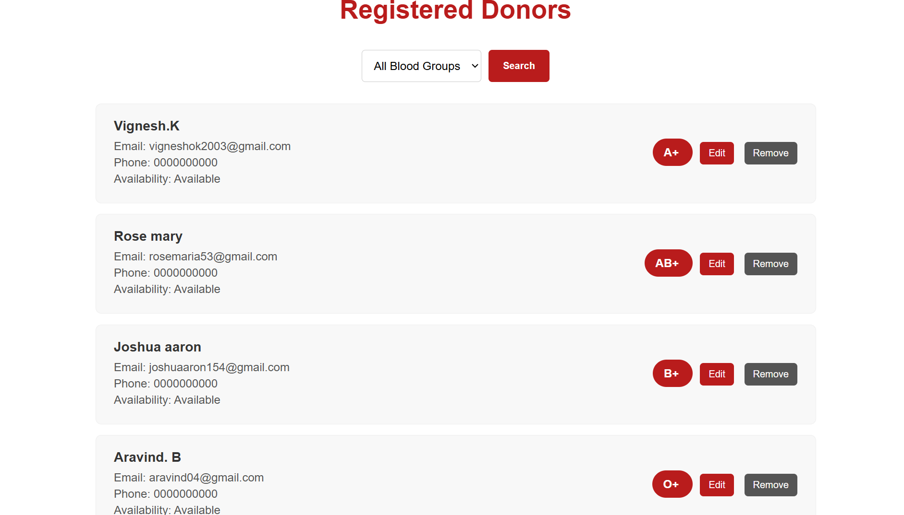
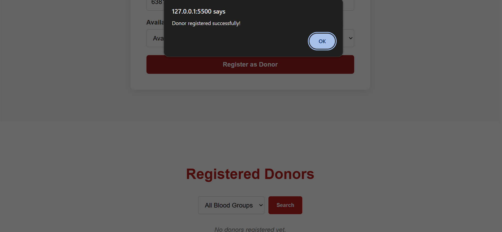

# BloodConnect 🩸

BloodConnect is a Blood Donor Management System designed to connect blood donors with people who need blood.

## Features

- Donor registration
- Donor list display
- Donor information validation
- Edit donor information
- Delete donor records
- Persistent donor data using SQLite
- REST API using Flask
- Frontend-backend integration
- Basic responsive frontend interface

## Technologies Used

- HTML
- CSS
- JavaScript
- Python
- Flask
- SQLite
- REST API

## Screenshots

### Home Page


### Donor Registration


### Registered Donors


### Registration Success


## Project Structure

```text
BloodConnect/
│
├── index.html
├── style.css
├── script.js
├── README.md
├── .gitignore
│
├── screenshots/
│   ├── home-page.png
│   ├── donor-registration.png
│   ├── registered-donors-phones-blurred.png
│   └── registration-success.png
│
└── backend/
    ├── app.py
    └── database.py
```
